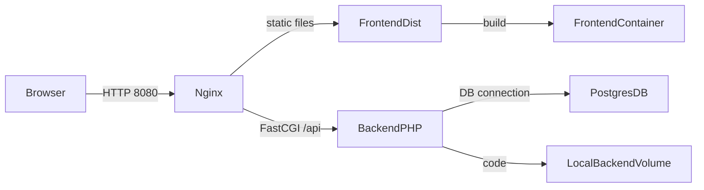

# Scan2Order

Sistema de gestión de pedidos de restaurantes.



> **Resumen visual:** las peticiones entran por Nginx, que sirve la SPA o reenvía los
> llamados al backend PHP; éste a su vez consulta PostgreSQL. Todo está encadenado
> dentro de una red Docker Compose.

## Requisitos

- Docker (Engine + Compose v2)
- Node.js y npm (solo para desarrollo si se construye manualmente)

## Estructura

```
scan2order/
├── backend/         # Laravel 10 app (PHP 8.2)
├── frontend/        # Vue 3 SPA (Vite)
├── docker/          # configuraciones de contenedores
│   ├── php/
│   └── nginx/
├── docker-compose.yml
└── README.md
```

## Configuración

1. Copia el fichero de entorno para el backend:
   ```sh
   cp backend/.env.example backend/.env
   ```
   Ajusta valores si es necesario (usuario/contraseña de PostgreSQL).

2. (Opcional) si modificas código PHP y necesitas instalar dependencias:
   ```sh
   docker-compose run --rm backend composer install
   ```

3. El código de la interfaz Vue ahora se encuentra en
   `backend/resources/js` y se despliega por Laravel/Vite. Para instalar
   dependencias y compilar manualmente usa el servicio Node incluido:
   ```sh
   cd backend
   npm install
   npm run dev   # inicia el servidor de desarrollo Vite
   ```
   También puedes ejecutar `docker-compose run --rm frontend npm run dev`
   que hace lo mismo dentro de un contenedor.

   ## Desarrollo del frontend

   - Rutas principales: `/` (health), `/login`, `/register`, `/restaurants`,
     `/categories`, `/products`, `/tables`, `/orders`, `/orders/:id`.
   - La SPA autentica contra los endpoints `api/login` y `api/register`.
   - Axios se configura automáticamente para enviar el token en cada
     petición.


## Levantar el proyecto

Todo el sistema puede iniciarse con un solo comando:

```sh
docker-compose up --build -d
```

Al finalizar el proceso:

- Laravel estará disponible en `http://localhost:8080/api`
- La SPA Vue se sirve en `http://localhost:8080/`
- PostgreSQL escucha en el puerto `5432` del host

El servicio `frontend` construye los assets y mantiene un contenedor en ejecución para que Nginx tenga acceso a la carpeta `dist` mediante un volumen compartido.

## Notas

- La base de datos usa PostgreSQL 15-alpine con volumen persistente `pgdata`.
- El contenedor `nginx` está basado en `nginx:stable-alpine` y configura rutas para la SPA y la API.
- PHP-FPM corre en el servicio `backend` escuchando en el puerto 9000.

¡Disfruta desarrollando! 😊
