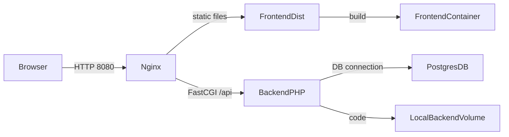

# Scan2Order

Sistema de gestión de pedidos de restaurantes.



> **Resumen visual:** las peticiones entran por Nginx, que sirve la SPA o reenvía los
> llamados al backend PHP; éste a su vez consulta PostgreSQL. Todo está encadenado
> dentro de una red Docker Compose.

## Requisitos

- Docker (Engine + Compose v2)
- Node.js y npm (solo para desarrollo si se construye manualmente)

## Estructura

```
scan2order/
├── backend/         # Laravel 10 app (PHP 8.2)
├── frontend/        # Vue 3 SPA (Vite)
├── docker/          # configuraciones de contenedores
│   ├── php/
│   └── nginx/
├── docker-compose.yml
└── README.md
```

## Configuración

El proyecto se configura automáticamente cuando se levanta con Docker. En la startup:

1. Se copia `.env.example` → `.env` en el backend
2. Se genera la `APP_KEY` 
3. Se ejecutan las migraciones de base de datos
4. Se fijan permisos de usuario en `storage` y `bootstrap/cache`

Si necesitas hacer cambios manuales:

```sh
# Editar variables de entorno si es necesario
cp backend/.env.example backend/.env
# Luego edita backend/.env con valores propios

# Para instalar dependencias del backend después de cambios
docker-compose exec backend composer install

# Para instalar dependencias del frontend
docker-compose exec frontend npm install
```

## Estructura del Proyecto

- **backend/** → Laravel 10 con API REST
  - `app/Models` → Modelos de datos (Restaurant, Product, Order, etc.)
  - `app/Http/Controllers` → Controllers de la API
  - `routes/api.php` → Rutas registradas de recursos
  - `database/migrations` → Migraciones de BD
  
- **frontend/** → Vue 3 SPA con Vite
  - `src/views` → Páginas principales (Restaurants, Orders, Products, Home)
  - `src/stores` → Pinia stores (gestión de estado)
  - `src/services` → Cliente API Fetch
  - `src/router` → Enrutador de la aplicación

- **docker/** → Dockerfiles y configuraciones
  - `php/Dockerfile` → Imagen PHP 8.2-FPM
  - `nginx/` → Config y Dockerfile de Nginx
  
- **docker-compose.yml** → Orquestación de 4 servicios (db, backend, frontend, nginx)

## Levantar el proyecto

Todo el sistema puede iniciarse con un solo comando:

```sh
docker-compose up --build -d
```

Al finalizar el proceso:

- Laravel estará disponible en `http://localhost:8080/api`
- La SPA Vue se sirve en `http://localhost:8080/`
- PostgreSQL escucha en el puerto `5433` del host (para evitar conflictos con PostgreSQL local)

El servicio `frontend` construye los assets y mantiene un contenedor en ejecución para que Nginx tenga acceso a la carpeta `dist` mediante un volumen compartido.

## Notas

- La base de datos usa PostgreSQL 15-alpine con volumen persistente `pgdata`.
- El contenedor `nginx` está basado en `nginx:stable-alpine` y configura rutas para la SPA y la API.
- PHP-FPM corre en el servicio `backend` escuchando en el puerto 9000.

¡Disfruta desarrollando! 😊
